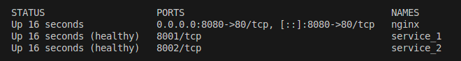
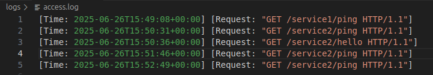

## 🚀 Setup Instructions

1. **Clone the repository**  
   ```bash
   git clone https://github.com/x-deepak/docker_assignment.git
   cd docker_assignment
   ```

2. **Build and start all services with Docker Compose**  
   ```bash
   docker compose up --build
   ```

3. **Access the services:**

   - **Via Nginx reverse proxy:**
     - [http://localhost:8080/service1/ping](http://localhost:8080/service1/ping)
     - [http://localhost:8080/service2/ping](http://localhost:8080/service2/ping)

    ---
    > **Note:** By default, the Go and Python services such as [http://localhost:8001/ping](http://localhost:8001/ping) are **not accessible directly from your host** because the `docker-compose.yml` uses `expose` (which only makes ports available to other containers).  
    > To access these services directly from your host (e.g., in a browser), update your `docker-compose.yml` to use `ports` like `8001:8001` and `8002:8002` for each service.


4. **Logs:**  
   - Nginx access logs are available in the `logs/` directory and are also shown in your terminal during `docker-compose up`.

---

## 🔀 How Routing Works

- **Nginx** acts as a reverse proxy on port `8080`.
- Requests to `/service1/` are routed to the Go service (`service_1`) on port `8001`.
- Requests to `/service2/` are routed to the Python Flask service (`service_2`) on port `8002`.
- Internal service communication uses Docker’s network, allowing Nginx to reach the services by their container names.

---

## 🎁 Bonus Features

- **Healthchecks:**  
  Both services implement `/ping` endpoints and Docker healthchecks to ensure they are running.  
  You can use `docker ps` to view the health status of each container in the "STATUS" column.

  Example output:
  
  

- **Custom Nginx Logging:**  
  Nginx logs each incoming request with a timestamp and path, viewable live in your terminal and in the `logs/` folder.

  Example output:

  

- **Automatic log folder creation:**  
  The `logs` directory is automatically created and mounted for persistent Nginx logs.
- **Direct and proxied access:**  
  By default, only Nginx proxy access is allowed—direct access to service ports is blocked for better security and control. This ensures all traffic goes through Nginx for centralized logging, routing, and protection.

---

## 📝 Project Structure

```
docker_assignment/
├── docker-compose.yml
├── logs/                # Nginx logs (created automatically)
├── nginx/
│   ├── Dockerfile
│   └── nginx.conf
├── service_1/
│   ├── Dockerfile
│   ├── main.go
│   └── README.md
└── service_2/
    ├── Dockerfile
    ├── app.py
    ├── pyproject.toml
    ├── uv.lock
    └── README.md
```
